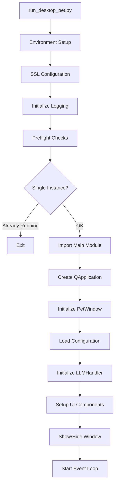
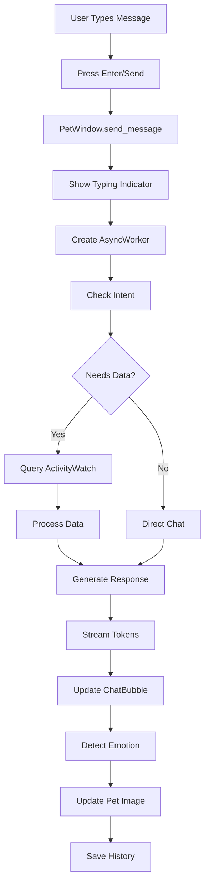
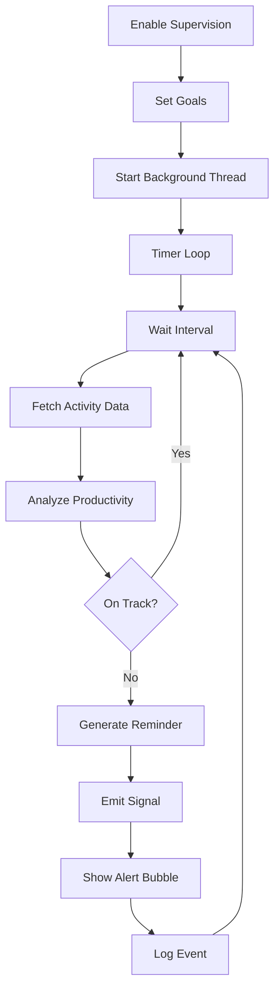
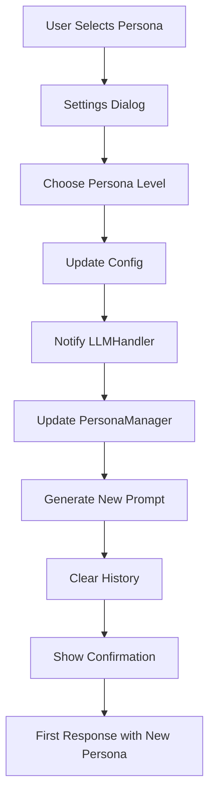
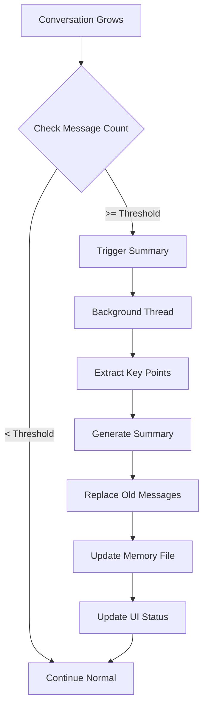
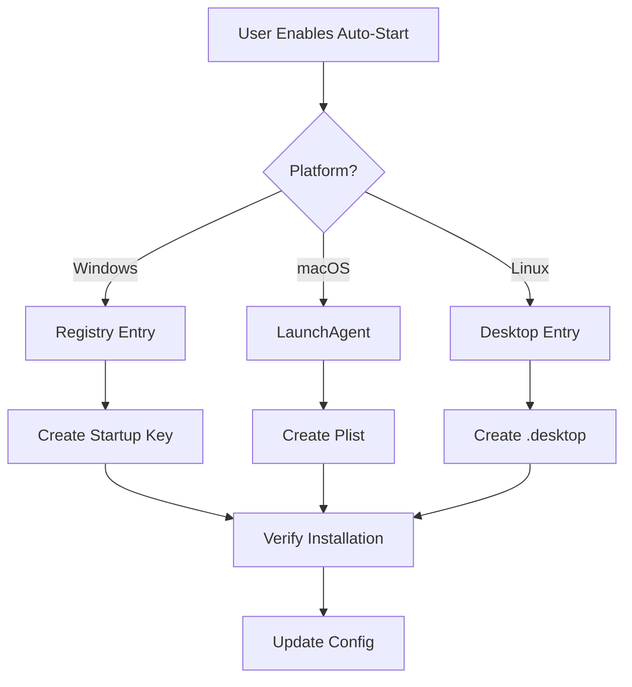
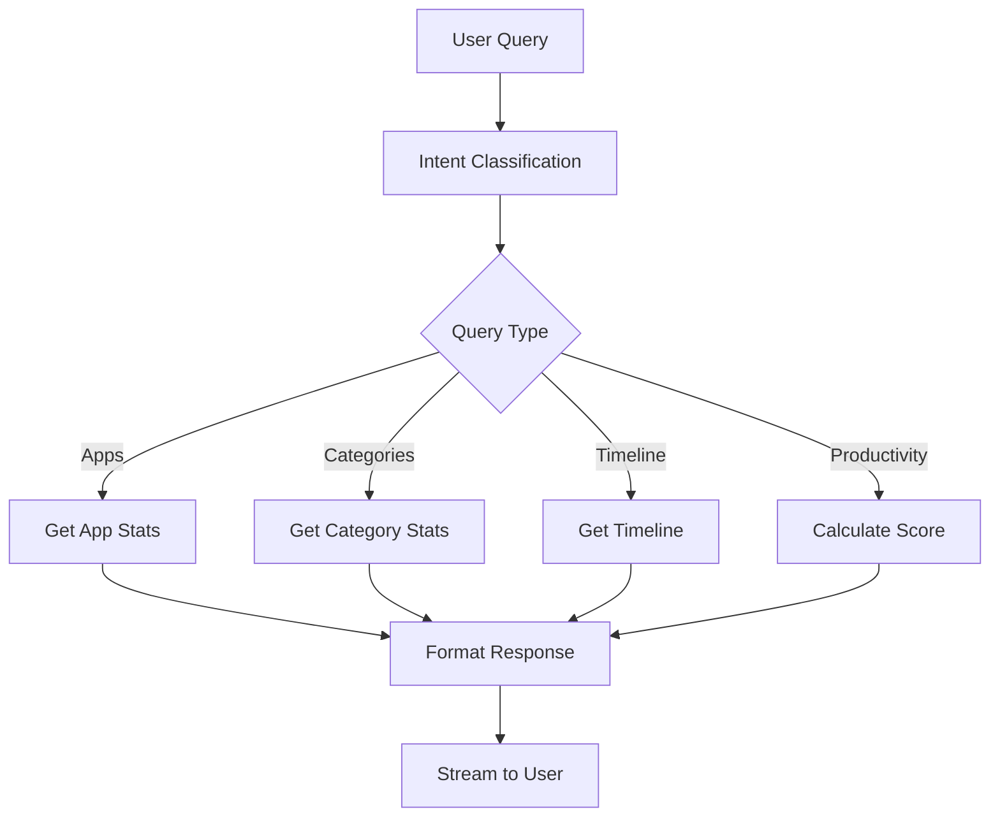
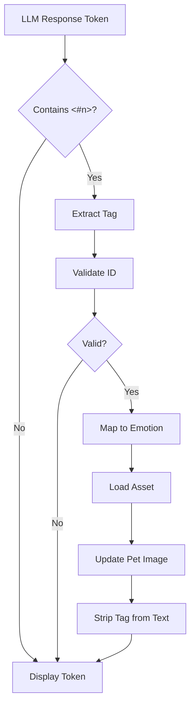
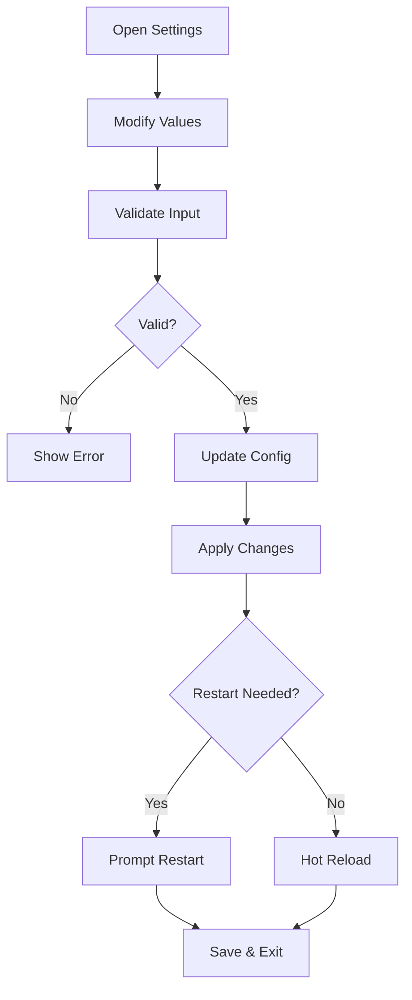
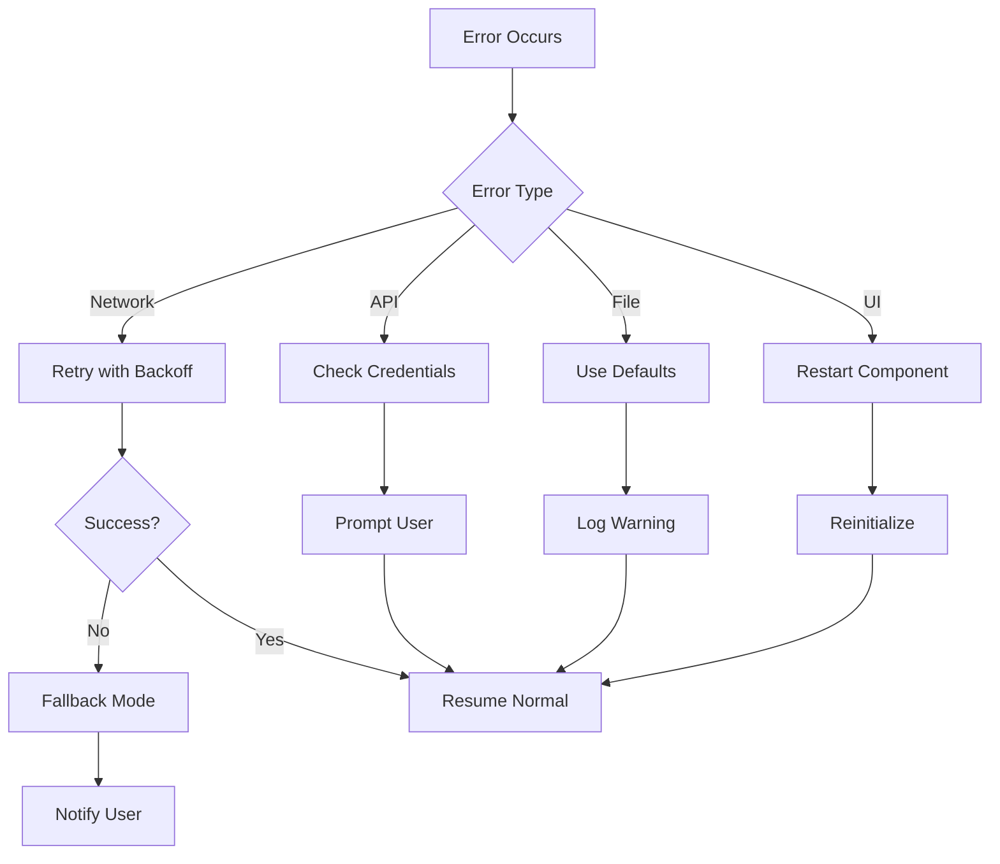

# Business Workflows Documentation

## Core Application Workflows

### 1. Application Startup Workflow



**Implementation Details:**

```python
# Startup sequence with error handling
try:
    # 1. Environment setup
    configure_ssl_if_needed()
    
    # 2. Logging initialization
    init_logging()
    logger.info("Starting application")
    
    # 3. Single instance check
    lock = check_single_instance()
    if not lock:
        sys.exit(0)
    
    # 4. Main application
    app = QApplication(sys.argv)
    pet = PetWindow()
    
    # 5. Configuration-based startup
    if config.get('start_minimized'):
        # Only show tray icon
        pet.tray_icon.show()
    else:
        pet.show()
    
    # 6. Run event loop
    sys.exit(app.exec())
    
finally:
    # Cleanup
    if lock:
        lock.release()
```

### 2. User Chat Interaction Workflow



**Key Functions:**

```python
def send_message(self):
    """Process user message"""
    # 1. Get input
    message = self.input_field.text()
    
    # 2. Display user message
    self.chat_bubble.add_user_message(message)
    
    # 3. Start async processing
    self.worker = AsyncWorker(self.llm_handler)
    self.worker.set_input(message)
    
    # 4. Connect signals
    self.worker.token_received.connect(self.on_token_received)
    self.worker.emotion_detected.connect(self.on_emotion_detected)
    self.worker.stream_finished.connect(self.on_stream_finished)
    
    # 5. Start worker
    self.worker.start()
```

### 3. Supervision Mode Workflow



**Supervision Logic:**

```python
def supervision_loop(self):
    """Background supervision thread"""
    while self.is_active:
        # Wait for check interval
        self._stop_event.wait(self.check_interval)
        
        if self._stop_event.is_set():
            break
        
        # Fetch recent activity
        activity = self.stats_processor.get_recent_activity(30)
        
        # Analyze productivity
        score = self.calculate_productivity_score(activity)
        
        if score < self.threshold:
            # Generate reminder
            reminder = self.generate_reminder(score, activity)
            
            # Emit to UI thread
            self.reminder_needed.emit(reminder)
            
            # Log for analysis
            logger.info(f"Productivity alert: {score:.2f}")
```

### 4. Persona Switching Workflow



**Persona Switch Implementation:**

```python
def switch_persona(self, level: PersonaLevel):
    """Switch to different personality"""
    # 1. Update manager
    self.persona_manager.set_persona(level)
    
    # 2. Get new prompt
    new_prompt = self.persona_manager.get_system_prompt()
    
    # 3. Clear conversation
    self.messages.clear()
    self.messages.append(SystemMessage(content=new_prompt))
    
    # 4. Update assistant
    self.assistant.conversation_history.clear()
    self.assistant._init_system_message()
    
    # 5. Save config
    self.config_manager.update_config({'persona_level': level.value})
    
    # 6. Notify user
    return "人格已切换。本座以新的姿态降临。"
```

### 5. Memory Management Workflow



**Memory Summarization:**

```python
async def summarize_conversation(self):
    """Summarize long conversations"""
    # 1. Check if needed
    if len(self.messages) < MEMORY['summary_threshold']:
        return
    
    # 2. Extract messages to summarize
    to_summarize = self.messages[1:MEMORY['summary_threshold']]
    
    # 3. Generate summary
    summary_prompt = "Summarize this conversation, keeping key points:"
    summary = await self.llm.agenerate(summary_prompt, to_summarize)
    
    # 4. Replace with summary
    self.messages = [
        self.messages[0],  # Keep system message
        AIMessage(content=f"[Previous conversation summary: {summary}]"),
        *self.messages[MEMORY['summary_threshold']:]
    ]
    
    # 5. Save to disk
    self._save_conversation_history()
```

### 6. Auto-Start Registration Workflow



**Platform-Specific Auto-Start:**

```python
class AutoStartManager:
    def enable_windows(self):
        """Windows auto-start via registry"""
        import winreg
        key = winreg.OpenKey(
            winreg.HKEY_CURRENT_USER,
            r"Software\Microsoft\Windows\CurrentVersion\Run",
            0,
            winreg.KEY_SET_VALUE
        )
        winreg.SetValueEx(
            key,
            "WatchCats",
            0,
            winreg.REG_SZ,
            sys.executable
        )
        winreg.CloseKey(key)
    
    def enable_macos(self):
        """macOS auto-start via LaunchAgent"""
        plist_content = f"""<?xml version="1.0" encoding="UTF-8"?>
        <!DOCTYPE plist PUBLIC "-//Apple//DTD PLIST 1.0//EN">
        <plist version="1.0">
        <dict>
            <key>Label</key>
            <string>com.watchcats.pet</string>
            <key>ProgramArguments</key>
            <array>
                <string>{sys.executable}</string>
            </array>
            <key>RunAtLoad</key>
            <true/>
        </dict>
        </plist>"""
        
        plist_path = Path.home() / 'Library/LaunchAgents/com.watchcats.pet.plist'
        plist_path.write_text(plist_content)
```

### 7. ActivityWatch Query Workflow



**Query Processing:**

```python
def process_activity_query(self, query: str):
    """Process ActivityWatch data query"""
    # 1. Parse command
    parsed = self.stats_parser.parse(query)
    
    # 2. Build AW query
    if parsed.query_type == "apps":
        data = self.stats_processor.get_app_usage(
            time_range=parsed.time_range
        )
    elif parsed.query_type == "categories":
        data = self.stats_processor.get_category_time(
            time_range=parsed.time_range
        )
    elif parsed.query_type == "productivity":
        data = self.stats_processor.get_productivity_score(
            productive_apps=parsed.filters.get('productive_apps', [])
        )
    
    # 3. Format response
    response = self.format_stats_response(data, parsed.format)
    
    return response
```

### 8. Emotion Detection Workflow



**Emotion Processing:**

```python
def process_emotion_tag(self, text: str) -> Tuple[str, str]:
    """Extract and process emotion tags"""
    # Pattern: <#1> through <#7>
    pattern = r'^<#([1-7])>\s*'
    match = re.match(pattern, text)
    
    if match:
        tag_id = int(match.group(1))
        
        # Map to emotion
        emotion_map = {
            1: 'happy', 2: 'happy',
            3: 'confused', 4: 'confused',
            5: 'normal',
            6: 'angry', 7: 'angry'
        }
        
        emotion = emotion_map.get(tag_id, 'normal')
        clean_text = re.sub(pattern, '', text)
        
        return emotion, clean_text
    
    return 'normal', text
```

### 9. Settings Update Workflow



**Settings Application:**

```python
def apply_settings(self, new_settings: Dict):
    """Apply configuration changes"""
    # 1. Validate
    valid, errors = validate_config(new_settings)
    if not valid:
        show_errors(errors)
        return False
    
    # 2. Determine changes
    changes = diff_configs(self.current_config, new_settings)
    
    # 3. Apply based on type
    for key, value in changes.items():
        if key == 'api_key':
            # Recreate LLM handler
            self.recreate_llm_handler(value)
        elif key == 'persona_level':
            # Switch persona
            self.switch_persona(PersonaLevel(value))
        elif key == 'theme':
            # Apply theme
            self.apply_theme(value)
        elif key in ['window_position', 'chat_size']:
            # Update UI
            self.update_ui_layout(key, value)
    
    # 4. Save
    self.config_manager.save_config()
    
    return True
```

### 10. Error Recovery Workflow



**Error Handler Pattern:**

```python
class ErrorHandler:
    def handle_error(self, error: Exception, context: str):
        """Centralized error handling"""
        logger.error(f"Error in {context}: {error}")
        
        if isinstance(error, NetworkError):
            # Retry with exponential backoff
            for attempt in range(3):
                try:
                    time.sleep(2 ** attempt)
                    return self.retry_operation()
                except:
                    continue
            
            # Fallback to offline mode
            self.enable_offline_mode()
            
        elif isinstance(error, APIError):
            if "unauthorized" in str(error).lower():
                # Invalid API key
                self.prompt_for_api_key()
            else:
                # Show user-friendly message
                self.show_error_dialog(
                    "API服务暂时不可用，请稍后再试"
                )
        
        elif isinstance(error, ConfigError):
            # Load defaults
            self.load_default_config()
            self.show_warning("配置已重置为默认值")
        
        else:
            # Unknown error - log and continue
            logger.exception("Unexpected error")
            self.show_error_dialog(
                "发生未知错误，部分功能可能受影响"
            )
```

## Workflow State Management

### State Transitions

```python
class WorkflowState(Enum):
    IDLE = "idle"
    PROCESSING = "processing"
    STREAMING = "streaming"
    ERROR = "error"
    RECOVERY = "recovery"

class WorkflowManager:
    def __init__(self):
        self.state = WorkflowState.IDLE
        self.state_history = []
    
    def transition(self, new_state: WorkflowState):
        """State transition with validation"""
        valid_transitions = {
            WorkflowState.IDLE: [WorkflowState.PROCESSING],
            WorkflowState.PROCESSING: [WorkflowState.STREAMING, WorkflowState.ERROR],
            WorkflowState.STREAMING: [WorkflowState.IDLE, WorkflowState.ERROR],
            WorkflowState.ERROR: [WorkflowState.RECOVERY, WorkflowState.IDLE],
            WorkflowState.RECOVERY: [WorkflowState.IDLE]
        }
        
        if new_state in valid_transitions[self.state]:
            self.state_history.append((self.state, new_state, time.time()))
            self.state = new_state
            logger.info(f"State transition: {self.state_history[-1]}")
        else:
            raise ValueError(f"Invalid transition: {self.state} -> {new_state}")
```

## Performance Optimizations

### Workflow Optimizations

1. **Lazy Loading**: Components loaded on-demand
2. **Async Operations**: Non-blocking I/O
3. **Caching**: Response and asset caching
4. **Batching**: Group similar operations
5. **Debouncing**: Limit rapid repeated actions

```python
class OptimizedWorkflow:
    def __init__(self):
        self._cache = {}
        self._pending_operations = []
        self._debounce_timer = None
    
    def cached_operation(self, key: str, operation: Callable):
        """Cache operation results"""
        if key not in self._cache:
            self._cache[key] = operation()
        return self._cache[key]
    
    def batch_operation(self, operation: Callable):
        """Batch similar operations"""
        self._pending_operations.append(operation)
        if len(self._pending_operations) >= 10:
            self._flush_batch()
    
    def debounced_operation(self, operation: Callable, delay: int = 500):
        """Debounce rapid calls"""
        if self._debounce_timer:
            self._debounce_timer.cancel()
        
        self._debounce_timer = Timer(delay / 1000, operation)
        self._debounce_timer.start()
```